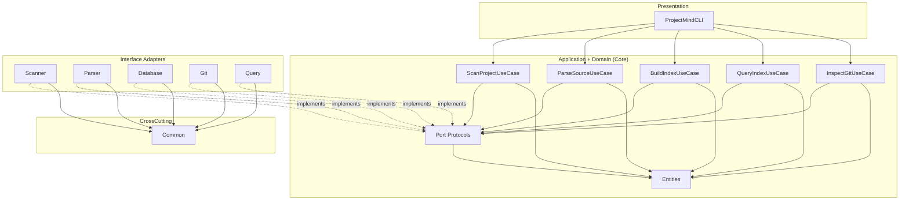
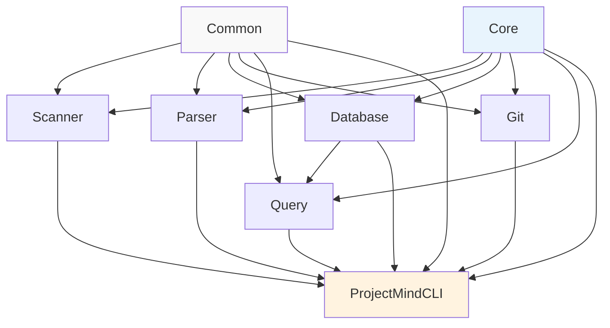
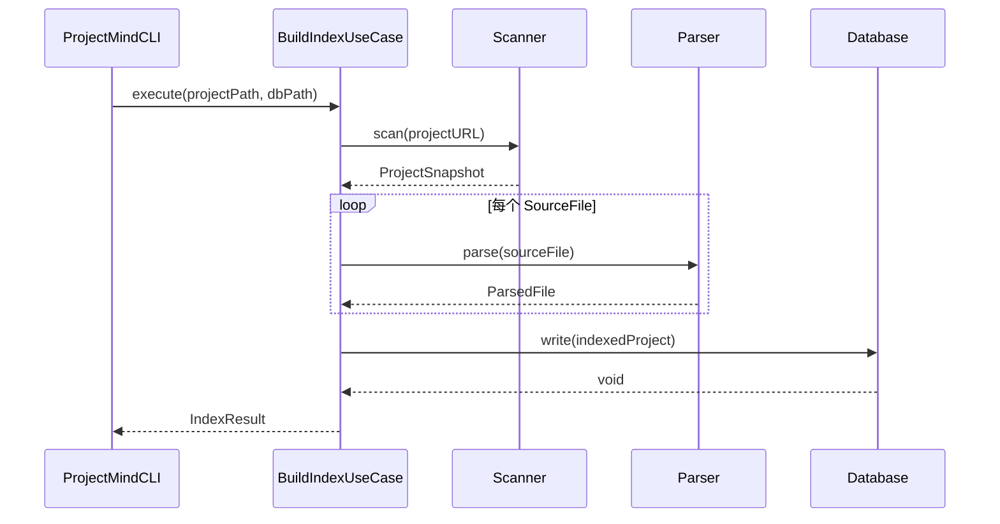
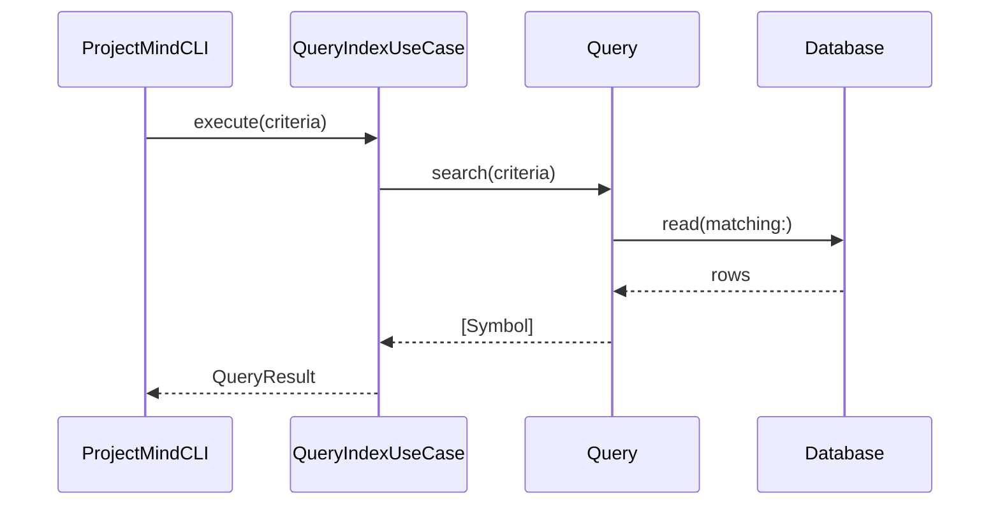
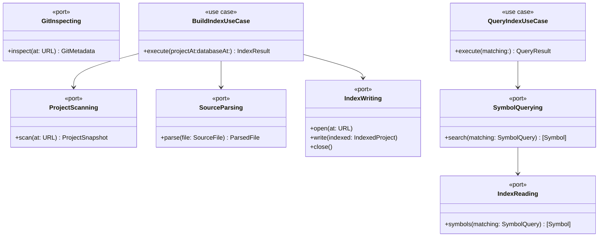
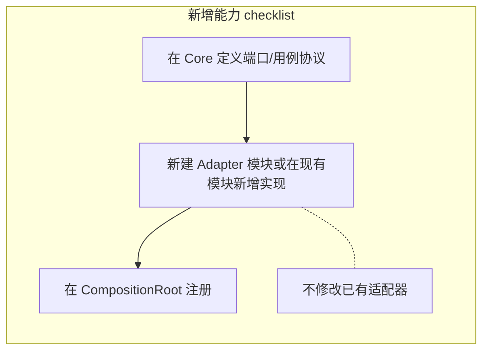
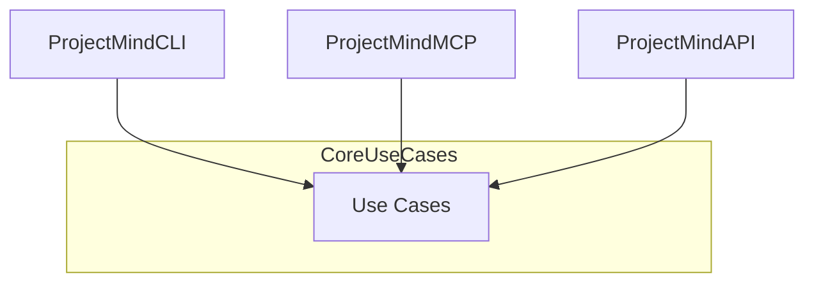

# ProjectMind 架构设计

> AI Coding Infrastructure — 为 AI 工具构建可查询的工程知识索引，而非 AI Chat。

---

## 1. 设计原则

| 原则 | 说明 |
|------|------|
| **Clean Architecture** | 依赖由外向内；内层定义协议，外层提供实现 |
| **单一职责** | 每个模块、每个 Use Case 只做一件事 |
| **协议通信** | 模块间仅通过 `Core` 中定义的协议交互，禁止直接引用具体实现 |
| **禁止 God Object** | 不允许出现聚合所有能力的超级类；编排逻辑拆分为独立 Use Case |
| **依赖隔离** | Scanner 不依赖 Parser；Parser 不依赖 Database |
| **开闭原则** | 新增语言、存储、VCS 后端时，扩展实现而非修改核心 |

---

## 2. Clean Architecture 分层

```
┌──────────────────────────────────────────────────────────────────────────┐
│                        Presentation Layer                                │
│                         ProjectMindCLI                                   │
│              命令解析 · 参数校验 · 依赖组装（Composition Root）            │
└────────────────────────────────┬─────────────────────────────────────────┘
                                 │ 调用 Use Case 协议
                                 ▼
┌──────────────────────────────────────────────────────────────────────────┐
│                       Application Layer                                  │
│                            Core                                          │
│   Use Cases（协议）  ·  Domain Entities  ·  Port Protocols（端口）        │
└────────────────────────────────┬─────────────────────────────────────────┘
                                 │ 端口由外层实现
                                 ▼
┌──────────────────────────────────────────────────────────────────────────┐
│                    Interface Adapters Layer                              │
│                                                                          │
│   Scanner    Parser    Database    Git    Query                          │
│   扫描适配器  解析适配器  存储适配器  VCS适配器  查询适配器                  │
└────────────────────────────────┬─────────────────────────────────────────┘
                                 │ 使用
                                 ▼
┌──────────────────────────────────────────────────────────────────────────┐
│                    Frameworks & Drivers Layer                            │
│                                                                          │
│   FileManager · SwiftSyntax · SQLite3 · libgit2 / git CLI                │
└──────────────────────────────────────────────────────────────────────────┘

         Common — 横切工具层（日志、路径、哈希），不依赖任何业务模块
```

### 各层职责

| 层级 | 模块 | 职责 | 禁止 |
|------|------|------|------|
| Presentation | `ProjectMindCLI` | 解析命令行、组装依赖、调度 Use Case | 业务逻辑、直接操作 SQLite / AST |
| Application + Domain | `Core` | 实体、端口协议、Use Case 协议 | 依赖 Scanner / Parser / Database 等实现 |
| Interface Adapters | `Scanner` `Parser` `Database` `Git` `Query` | 实现 `Core` 端口协议 | 互相直接依赖 |
| Cross-cutting | `Common` | 纯工具函数 | 依赖 `Core` 或任何适配器 |

---

## 3. 模块关系图

### 3.1 逻辑关系（Clean Architecture 视角）



### 3.2 SPM Target 物理依赖图



> **说明**：CLI 作为 Composition Root，在运行时注入各适配器实现，编译期依赖所有模块，但自身不包含业务逻辑。

### 3.3 数据流（索引构建）



### 3.4 数据流（查询）



---

## 4. 依赖关系

### 4.1 依赖矩阵

| 模块 ↓ 依赖 → | Common | Core | Scanner | Parser | Database | Git | Query | CLI |
|---------------|:------:|:----:|:-------:|:------:|:--------:|:---:|:-----:|:---:|
| **Common**    | —      | ✗    | ✗       | ✗      | ✗        | ✗   | ✗     | ✗   |
| **Core**      | ✗      | —    | ✗       | ✗      | ✗        | ✗   | ✗     | ✗   |
| **Scanner**   | ✓      | ✓    | —       | **✗**  | **✗**    | ✗   | ✗     | ✗   |
| **Parser**    | ✓      | ✓    | **✗**   | —      | **✗**    | ✗   | ✗     | ✗   |
| **Database**  | ✓      | ✓    | ✗       | ✗      | —        | ✗   | ✗     | ✗   |
| **Git**       | ✓      | ✓    | ✗       | ✗      | ✗        | —   | ✗     | ✗   |
| **Query**     | ✓      | ✓    | ✗       | ✗      | ✓        | ✗   | —     | ✗   |
| **CLI**       | ✓      | ✓    | ✓       | ✓      | ✓        | ✓   | ✓     | —   |

**硬性约束：**

- Scanner **不得** 依赖 Parser、Database、Query
- Parser **不得** 依赖 Database、Scanner、Query
- Database **不得** 依赖 Scanner、Parser
- Query **仅** 依赖 Database（读侧），不依赖 Scanner / Parser
- Git 与 Scanner / Parser 平行，互不依赖
- Core 与 Common 为最内层，不依赖任何业务模块

### 4.2 依赖方向规则

```
向外 ──────────────────────────────────────────────► 向内
CLI → Use Cases → Port Protocols → Domain Entities
      ↑ 实现
Scanner / Parser / Database / Git / Query
```

**依赖倒置（DIP）**：`BuildIndexUseCase` 依赖 `ProjectScanning`、`SourceParsing`、`IndexWriting` 协议，而非 `SwiftProjectScanner` 或 `SwiftSourceParser` 具体类型。

---

## 5. 协议设计

所有协议定义在 **Core** 模块。适配器模块实现协议，Use Case 消费协议。

### 5.1 领域实体（Entities）

```swift
// Core/Entities/

public struct SourceFile: Sendable, Identifiable { ... }
public struct ProjectSnapshot: Sendable { ... }
public struct Symbol: Sendable, Identifiable { ... }
public struct ParsedFile: Sendable { ... }
public struct IndexedProject: Sendable { ... }
public struct GitMetadata: Sendable { ... }
public struct SymbolQuery: Sendable { ... }
```

实体为纯值类型，不含 IO、不含框架依赖。

### 5.2 端口协议（Ports）— 基础设施边界

#### 扫描端口

```swift
/// 端口：项目文件发现
/// 实现方：Scanner 模块
public protocol ProjectScanning: Sendable {
    func scan(at url: URL) async throws -> ProjectSnapshot
}
```

#### 解析端口

```swift
/// 端口：单文件 AST 解析
/// 实现方：Parser 模块
public protocol SourceParsing: Sendable {
    var supportedLanguages: [SourceLanguage] { get }
    func parse(file: SourceFile) async throws -> ParsedFile
}
```

#### 存储端口（读写分离 — 接口隔离 ISP）

```swift
/// 端口：索引写入
/// 实现方：Database 模块
public protocol IndexWriting: Sendable {
    func open(at url: URL) async throws
    func write(indexed: IndexedProject) async throws
    func close() async throws
}

/// 端口：索引读取
/// 实现方：Database 模块
public protocol IndexReading: Sendable {
    func open(at url: URL) async throws
    func projectMetadata() async throws -> ProjectSnapshot?
    func symbols(matching query: SymbolQuery) async throws -> [Symbol]
    func close() async throws
}
```

#### Git 端口

```swift
/// 端口：版本控制元数据
/// 实现方：Git 模块
public protocol GitInspecting: Sendable {
    func inspect(at url: URL) async throws -> GitMetadata
    func fileHistory(path: String, in repository: URL) async throws -> [GitCommit]
}
```

#### 查询端口

```swift
/// 端口：面向业务的索引查询（可组合多个读端口）
/// 实现方：Query 模块
public protocol SymbolQuerying: Sendable {
    func search(matching criteria: SymbolQuery) async throws -> [Symbol]
    func findDefinition(of name: String) async throws -> Symbol?
    func listImports(in fileID: String) async throws -> [ImportStatement]
}
```

### 5.3 用例协议（Use Cases）— 应用层边界

每个 Use Case 单一职责，避免 God Object：

```swift
/// 用例：扫描项目目录
public protocol ScanProjectUseCase: Sendable {
    func execute(at url: URL) async throws -> ProjectSnapshot
}

/// 用例：解析单个源文件
public protocol ParseSourceUseCase: Sendable {
    func execute(file: SourceFile) async throws -> ParsedFile
}

/// 用例：构建完整索引（编排扫描 + 解析 + 写入）
public protocol BuildIndexUseCase: Sendable {
    func execute(projectAt: URL, databaseAt: URL) async throws -> IndexResult
}

/// 用例：查询索引
public protocol QueryIndexUseCase: Sendable {
    func execute(matching criteria: SymbolQuery) async throws -> QueryResult
}

/// 用例：检查 Git 元数据
public protocol InspectGitUseCase: Sendable {
    func execute(at url: URL) async throws -> GitMetadata
}
```

### 5.4 Use Case 实现模式（无 God Object）

`BuildIndexUseCase` 是**编排者**，不包含扫描/解析/存储的具体逻辑：

```swift
// Core/UseCases/DefaultBuildIndexUseCase.swift

public struct DefaultBuildIndexUseCase: BuildIndexUseCase, Sendable {
    private let scanner: any ProjectScanning      // 端口
    private let parser: any SourceParsing          // 端口
    private let writer: any IndexWriting           // 端口

    public init(
        scanner: any ProjectScanning,
        parser: any SourceParsing,
        writer: any IndexWriting
    ) { ... }

    public func execute(projectAt: URL, databaseAt: URL) async throws -> IndexResult {
        let snapshot = try await scanner.scan(at: projectAt)
        var parsed: [ParsedFile] = []
        for file in snapshot.sourceFiles {
            parsed.append(try await parser.parse(file: file))
        }
        let indexed = IndexedProject(snapshot: snapshot, parsedFiles: parsed)
        try await writer.open(at: databaseAt)
        defer { try? await writer.close() }
        try await writer.write(indexed: indexed)
        return IndexResult(from: indexed)
    }
}
```

**职责边界：**

| 类型 | 职责 | 示例 |
|------|------|------|
| Use Case | 编排、流程控制 | `DefaultBuildIndexUseCase` |
| Port Adapter | 单一技术能力 | `SwiftProjectScanner`, `SQLiteIndexWriter` |
| Entity | 数据载体 | `Symbol`, `ProjectSnapshot` |
| CLI | 解析命令 + 注入依赖 | `CommandParser`, `CompositionRoot` |

### 5.5 协议总览



---

## 6. 模块详细说明

### 6.1 Common

- 路径规范化、SHA256 哈希、日志协议
- 不依赖 `Core`，可被所有外层模块使用

### 6.2 Core

- 领域实体、错误类型
- 全部端口协议与用例协议
- 默认 Use Case 实现（仅编排，无框架依赖）
- **不引入** SwiftSyntax、SQLite、Git 等框架

### 6.3 Scanner

- 实现 `ProjectScanning`
- 识别 SPM / Xcode / 纯目录
- 枚举 `.swift` 文件，过滤 `.build`、`Pods` 等
- 输出 `ProjectSnapshot`，**不知道** AST 或数据库的存在

### 6.4 Parser

- 实现 `SourceParsing`
- 基于 SwiftSyntax 提取 Symbol / Import
- 输入 `SourceFile`，输出 `ParsedFile`，**不知道** 文件从哪扫描、数据存去哪

### 6.5 Database

- 实现 `IndexWriting` + `IndexReading`
- SQLite 表结构与迁移
- **不知道** 扫描与解析过程

### 6.6 Git

- 实现 `GitInspecting`
- 提取 branch、commit、blame、文件历史
- 与 Scanner / Parser 完全独立，可按需挂载到索引流程

### 6.7 Query

- 实现 `SymbolQuerying`
- 组合 `IndexReading` 提供高级查询（定义跳转、引用搜索）
- 依赖 Database，**不依赖** Scanner / Parser

### 6.8 ProjectMindCLI

- `CommandParser`：解析子命令与参数
- `CompositionRoot`：组装具体适配器并注入 Use Case
- 每个子命令调用**一个** Use Case，自身零业务逻辑

---

## 7. 未来扩展能力

### 7.1 扩展矩阵

| 扩展方向 | 扩展方式 | 影响范围 | 阶段 |
|----------|----------|----------|------|
| 新语言（Kotlin、Go） | 新增 `KotlinParser: SourceParsing` | 仅新增 Parser target | Phase 2+ |
| 新存储（PostgreSQL、JSON） | 新增 `PostgresIndexWriter: IndexWriting` | 仅新增 Database 适配器 | Phase 2+ |
| 新 VCS（Mercurial） | 新增 `HgInspector: GitInspecting` | 仅新增 Git 适配器 | Phase 3+ |
| 符号引用分析 | 新增 `ReferenceAnalyzer` Use Case + 端口 | Core 新增协议，Parser 扩展 | Phase 2 |
| Embedding 索引 | 新模块 `Embedding`，依赖 `SymbolQuerying` | 独立 target，不改现有模块 | Phase 3+ |
| MCP Server | 新 Presentation target `ProjectMindMCP` | 复用全部 Use Case | Phase 3+ |
| LSP 集成 | 新 Presentation target `ProjectMindLSP` | 复用 Query Use Case | Phase 4+ |
| 增量索引 | 新增 `IncrementalIndexUseCase` | Core 新用例 + Database 扩展 | Phase 2 |
| 远程索引同步 | 新增 `IndexSyncPort` | Core 新端口 + 新适配器 | Phase 4+ |

### 7.2 扩展原则



1. **先定义协议，再写实现** — 扩展从 Core 向内生长
2. **不改已有模块接口** — 符合开闭原则（OCP）
3. **Presentation 层可无限扩展** — CLI、MCP、LSP、HTTP API 共享同一套 Use Case
4. **LLM 不作为核心** — 未来可作为 Consumer 调用 `QueryIndexUseCase` 获取上下文

### 7.3 多 Presentation 层架构（远期）



### 7.4 插件化（远期）

```swift
/// 未来插件注册端口
public protocol ModuleRegistering: Sendable {
    func registerParser() -> any SourceParsing
    func registerScanner() -> any ProjectScanning
}
```

插件通过协议注册到 `CompositionRoot`，核心代码无需感知插件类型。

---

## 8. 反模式清单

| 反模式 | 说明 | 正确做法 |
|--------|------|----------|
| **God Object** | `ProjectMindEngine` 包揽扫描/解析/存储/查询 | 拆分为独立 Use Case |
| **Scanner → Parser** | 扫描时同步解析 | 由 `BuildIndexUseCase` 编排 |
| **Parser → Database** | 解析后直接写入 | 由 `BuildIndexUseCase` 调用 `IndexWriting` |
| **具体类型渗透** | Use Case 依赖 `SQLiteIndexStore` | 依赖 `IndexWriting` 协议 |
| **CLI 业务逻辑** | `main.swift` 中写 SQL 或 AST 遍历 | CLI 只调用 Use Case |
| **Core 框架依赖** | Core 引入 SwiftSyntax | SwiftSyntax 仅在 Parser 中 |
| **Query → Scanner** | 查询时重新扫描目录 | 查询只走 `IndexReading` |

---

## 9. 目录结构映射

```
Sources/
├── Common/                     # 工具层
│   ├── Logging/
│   ├── PathUtils/
│   └── Hashing/
│
├── Core/                       # 应用层 + 领域层
│   ├── Entities/
│   ├── Errors/
│   ├── Ports/                  # 基础设施端口协议
│   ├── UseCases/               # 用例协议 + 默认实现
│   └── Results/
│
├── Scanner/                    # 扫描适配器
│   └── SwiftProjectScanner.swift
│
├── Parser/                     # 解析适配器
│   └── SwiftSourceParser.swift
│
├── Database/                   # 存储适配器
│   ├── SQLiteIndexWriter.swift
│   └── SQLiteIndexReader.swift
│
├── Git/                        # VCS 适配器
│   └── GitCLIInspector.swift
│
├── Query/                      # 查询适配器
│   └── DefaultSymbolQueryEngine.swift
│
└── ProjectMindCLI/             # 表现层
    ├── CommandParser.swift
    ├── CompositionRoot.swift
    └── main.swift
```

---

## 10. 总结

ProjectMind 以 **Clean Architecture** 为核心，通过 **Core 协议层** 隔离所有模块：

- **向内**：CLI → Use Cases → Ports → Entities
- **向外**：各 Adapter 实现 Port，彼此不直接通信
- **Scanner、Parser、Database** 形成单向流水线，由 `BuildIndexUseCase` 编排，严格满足「Scanner 不依赖 Parser、Parser 不依赖 Database」
- **无 God Object**：每个 Use Case 单一职责，Composition Root 负责组装
- **面向扩展**：新语言、新存储、新交互方式均通过新增协议实现接入，不破坏现有结构
