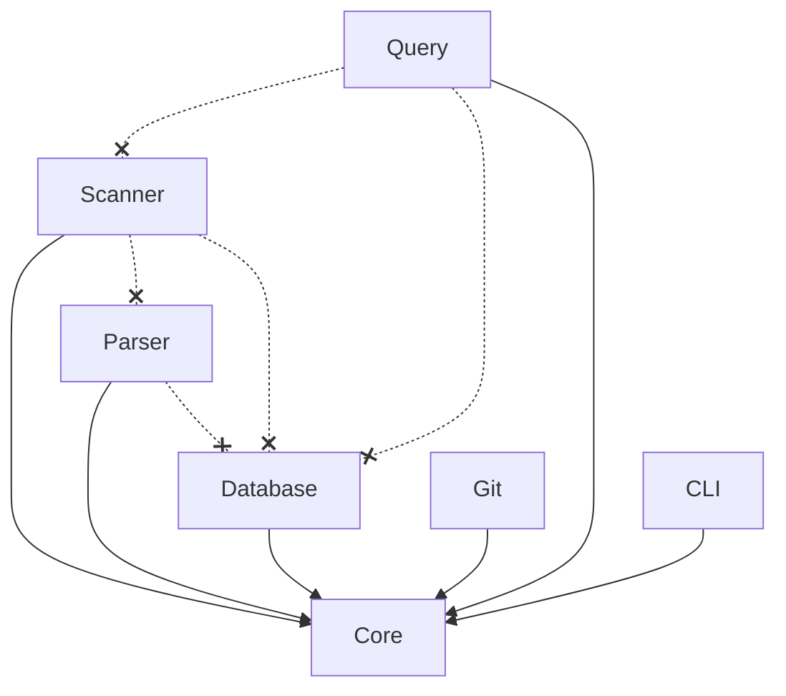
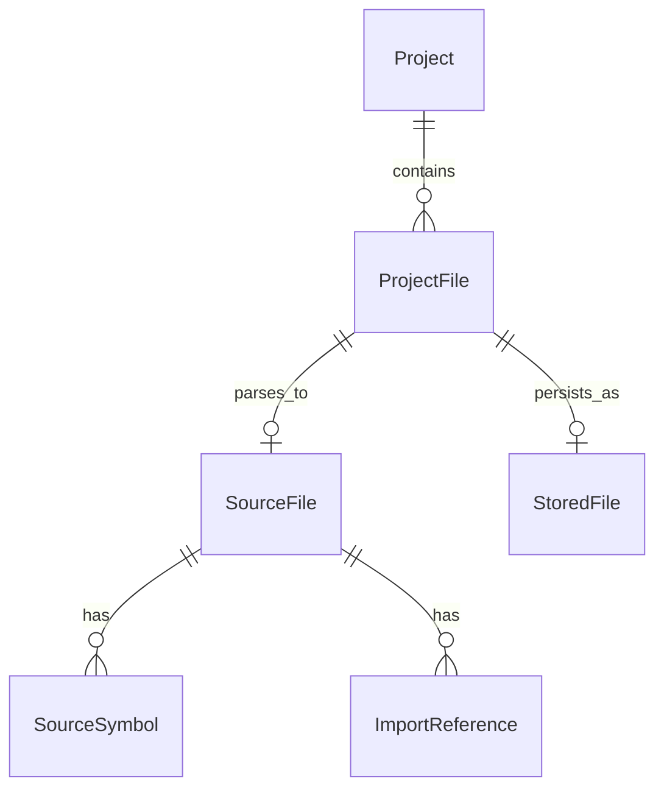
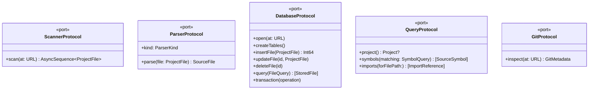
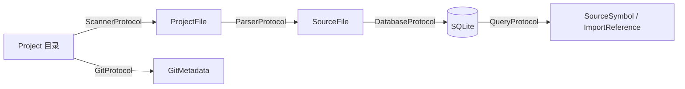

# Core 模块设计

Core 是整个 ProjectMind 系统的**领域层与端口层**。所有业务模块只依赖 Core，模块之间禁止互相引用。

---

## 1. 设计原则

| 原则 | 说明 |
|------|------|
| **单一真相源** | 所有公共模型与协议只在 Core 定义 |
| **依赖倒置** | 外层模块实现 Core 协议，不反向依赖 |
| **无框架依赖** | Core 不引入 SwiftSyntax、SQLite、Git 等 |
| **值类型优先** | 实体使用 `struct`，保证 `Sendable` |

---

## 2. 模块依赖图



> 虚线 × 表示**禁止**的依赖方向。Query 通过 `QueryProtocol` 抽象读索引，运行时由 Composition Root 注入 `DatabaseProtocol` 实现。

---

## 3. 公共模型

### 3.1 模型关系



### 3.2 模型定义

#### Project — 工程根元数据

```swift
public struct Project: Sendable, Equatable, Identifiable {
    public let id: String
    public let rootPath: String
    public let name: String
    public let kind: ProjectKind      // swiftPackage | xcodeProject | plainDirectory
    public let scannedAt: Date
}
```

#### ProjectFile — 扫描发现的文件

```swift
public struct ProjectFile: Sendable, Equatable, Hashable, Identifiable {
    public let path: String
    public let filename: String       // 不含扩展名
    public let ext: String
    public let size: Int64
    public let modifiedDate: Date
}
```

| 产出方 | 消费方 |
|--------|--------|
| Scanner | Parser, Database |

#### SourceFile — 解析结果

```swift
public struct SourceFile: Sendable, Equatable {
    public let file: ProjectFile
    public let symbols: [SourceSymbol]
    public let imports: [ImportReference]
}
```

| 产出方 | 消费方 |
|--------|--------|
| Parser | Database, Query |

#### SourceSymbol — 统一符号模型

```swift
public struct SourceSymbol: Sendable, Equatable, Identifiable {
    public let id: String
    public let name: String
    public let kind: SymbolKind      // class | struct | enum | function | protocol | ...
    public let filePath: String
    public let location: SourceLocation?
    public let accessLevel: String?
    public let parentName: String?
    public let signature: String?
}
```

> 不再为 Class / Struct / Enum 分别定义类型，统一为 `SourceSymbol` + `SymbolKind`，便于 Query 和 Database 处理。

#### ImportReference — 导入引用

```swift
public struct ImportReference: Sendable, Equatable, Identifiable {
    public let id: String
    public let moduleName: String
    public let filePath: String
    public let location: SourceLocation?
}
```

### 3.3 辅助模型

| 模型 | 用途 |
|------|------|
| `SourceLocation` | 行列位置 |
| `SymbolKind` | 符号分类枚举 |
| `ParserKind` | 解析引擎标识（treeSitter / sourceKit / swiftSyntax） |
| `FileQuery` | Database 文件查询条件 |
| `SymbolQuery` | Query 符号查询条件 |
| `StoredFile` | Database 持久化记录（含 `id`） |
| `GitMetadata` | Git 仓库元数据 |

---

## 4. 端口协议

### 4.1 协议总览



### 4.2 ScannerProtocol

```swift
public protocol ScannerProtocol: Sendable {
    associatedtype Files: AsyncSequence & Sendable where Files.Element == ProjectFile
    func scan(at url: URL) -> Files
}
```

- **实现方**：Scanner 模块（`SwiftProjectScanner`）
- **输出**：`ProjectFile` 流（AsyncSequence，惰性产出）

### 4.3 ParserProtocol

```swift
public protocol ParserProtocol: Sendable {
    var kind: ParserKind { get }
    func parse(file: ProjectFile) async throws -> SourceFile
}
```

- **实现方**：Parser 模块（`TreeSitterParser` / `SourceKitParser` / `SwiftSyntaxParser`）
- **输入**：`ProjectFile` → **输出**：`SourceFile`

### 4.4 DatabaseProtocol

```swift
public protocol DatabaseProtocol: Sendable {
    func open(at url: URL) async throws
    func close() async throws
    func createTables() async throws
    func insertFile(_ file: ProjectFile) async throws -> Int64
    func updateFile(id: Int64, file: ProjectFile) async throws
    func deleteFile(id: Int64) async throws
    func query(_ query: FileQuery) async throws -> [StoredFile]
    func transaction<T>(_ operation: () async throws -> T) async throws -> T
}
```

- **实现方**：Database 模块（`SQLiteDatabase`）

### 4.5 QueryProtocol

```swift
public protocol QueryProtocol: Sendable {
    func project() async throws -> Project?
    func symbols(matching query: SymbolQuery) async throws -> [SourceSymbol]
    func imports(forFilePath path: String) async throws -> [ImportReference]
}
```

- **实现方**：Query 模块
- **注意**：Query 模块编译期不依赖 Database，运行时通过依赖注入获取 `DatabaseProtocol`

### 4.6 GitProtocol

```swift
public protocol GitProtocol: Sendable {
    func inspect(at url: URL) async throws -> GitMetadata
}
```

- **实现方**：Git 模块

---

## 5. 数据流



---

## 6. 目录结构

```
Core/
├── Entities/
│   ├── Project.swift
│   ├── ProjectKind.swift
│   ├── ProjectFile.swift
│   ├── SourceFile.swift
│   ├── SourceSymbol.swift
│   ├── SymbolKind.swift
│   ├── ImportReference.swift
│   ├── SourceLocation.swift
│   ├── ParserKind.swift
│   ├── FileQuery.swift
│   ├── SymbolQuery.swift
│   ├── StoredFile.swift
│   └── GitMetadata.swift
├── Protocols/
│   ├── ScannerProtocol.swift
│   ├── ParserProtocol.swift
│   ├── DatabaseProtocol.swift
│   ├── QueryProtocol.swift
│   └── GitProtocol.swift
└── Errors/
    └── ProjectMindError.swift
```

---

## 7. 模块实现映射

| Core 协议 | 实现模块 | 实现类型 |
|-----------|----------|----------|
| `ScannerProtocol` | Scanner | `SwiftProjectScanner` |
| `ParserProtocol` | Parser | `TreeSitterParser` / `SourceKitParser` / `SwiftSyntaxParser` |
| `DatabaseProtocol` | Database | `SQLiteDatabase` |
| `QueryProtocol` | Query | `QueryModule` |
| `GitProtocol` | Git | `GitModule` |

---

## 8. 扩展规则

1. **新增模型** → 只在 `Core/Entities/` 添加
2. **新增能力** → 在 Core 定义协议，在外层模块实现
3. **禁止** 在 Scanner / Parser / Database / Git / Query 之间直接 `import`
4. **编排逻辑**（scan → parse → index）放在 CLI 或未来 Application 层，通过协议注入完成
