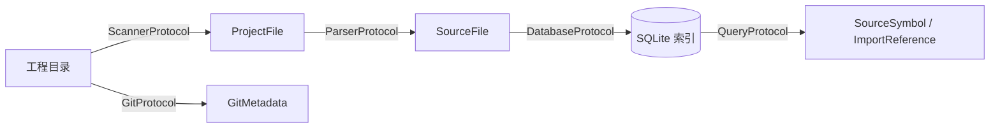

<p align="center">
  <h1 align="center">ProjectMind</h1>
  <p align="center">
    <strong>AI Coding Infrastructure — 不是 AI Chat。</strong>
  </p>
  <p align="center">
    为大型工程构建持久、可查询的 <em>Project Knowledge Index</em>，<br/>
    让 Claude、Codex、Cursor、Gemini 等 AI 更快、更准地理解你的代码。
  </p>
</p>

<p align="center">
  <a href="#快速开始">快速开始</a> ·
  <a href="#架构设计">架构设计</a> ·
  <a href="#模块介绍">模块介绍</a> ·
  <a href="#roadmap">Roadmap</a> ·
  <a href="#开发规范">开发规范</a> ·
  <a href="Docs/Core.md">Core 设计文档</a>
</p>

---

## ProjectMind 是什么

**ProjectMind** 是一个开源的 **AI 编程基础设施（AI Coding Infrastructure）**，用于构建结构化、可查询的 **工程知识索引（Project Knowledge Index）**。

它扫描真实的 Swift 工程，提取源码级知识，持久化到 SQLite，并通过协议化的 API 对外暴露。索引供 AI 编程工具作为**确定性上下文**消费——而不是作为一个聊天壳。

```
┌─────────────────────────────────────────────────────────────────┐
│                        AI 编程工具                               │
│              Claude · Codex · Cursor · Gemini · …               │
└───────────────────────────────┬─────────────────────────────────┘
                                │ 读取索引 / 符号 / 导入关系
                                ▼
┌─────────────────────────────────────────────────────────────────┐
│                         ProjectMind                             │
│                                                                 │
│   Scanner ──► Parser ──► Database ──► Query                   │
│      │                      ▲                                   │
│      └──── Git 元数据 ──────┘                                   │
└───────────────────────────────┬─────────────────────────────────┘
                                │ 索引
                                ▼
┌─────────────────────────────────────────────────────────────────┐
│                    你的 Swift 工程                               │
└─────────────────────────────────────────────────────────────────┘
```

**ProjectMind 不是什么：**

- 不是 Chat 产品
- 不是 Prompt 模板库
- 不是 Agent 框架
- 不是 MCP Server（Phase 1 范围内）

它是上述一切之下的**基础设施层**。

---

## 为什么存在

AI 编程工具很强，但在**大型真实工程**中仍然面临结构性问题：

| 痛点 | 现状 | ProjectMind 的解法 |
|------|------|-------------------|
| **上下文窗口有限** | AI 只能看到少量打开的文件 | 预索引整个工程结构 |
| **理解停留在表面** | 靠文件名和文本搜索凑合 | 结构化符号、导入、关系 |
| **每次会话重新发现** | 没有持久化知识 | 本地 SQLite 知识索引 |
| **集成脆弱** | 各工具各自写脚本 | 协议优先，任何消费者可接入 |
| **LLM 充当核心** | 解析逻辑藏在 Prompt 里 | 核心管线零 LLM 依赖 |

我们相信：AI 辅助软件工程缺失的那一层，是**持久、确定、可复用的工程知识**——由工具构建，本地存储，跨 AI 工作流共享。

### 核心原则

1. **绝不以 LLM 作为核心能力** — LLM 是后期增强层，不是引擎。
2. **一切围绕「帮助 AI 理解工程」** — 每个功能都服务于此目标。
3. **协议优于实现** — 解析器、存储、消费者可自由替换。
4. **本地优先、确定性** — 可复现的索引，你拥有完全控制权。

---

## 架构设计

ProjectMind 遵循 **Clean Architecture**，模块边界严格隔离。

### 分层结构

```
┌──────────────────────────────────────────────────────────────┐
│  表现层              ProjectMindCLI                          │
│                      命令解析 · 依赖组装（Composition Root）  │
├──────────────────────────────────────────────────────────────┤
│  应用层 + 领域层      Core                                   │
│                      实体 · 端口协议 · 错误类型               │
├──────────────────────────────────────────────────────────────┤
│  适配器层            Scanner · Parser · Database · Git · Query │
├──────────────────────────────────────────────────────────────┤
│  框架层              FileManager · SwiftSyntax · SQLite3    │
└──────────────────────────────────────────────────────────────┘
```

### 依赖规则

```
                    Core
                     ▲
       ┌─────────────┼─────────────┬─────────┐
       │             │             │         │
   Scanner       Parser       Database     Git
                                  ▲
                                Query
```

| 规则 | 说明 |
|------|------|
| **Core 是唯一契约** | 所有公共模型和协议定义在 `Core` |
| **禁止跨模块引用** | Scanner / Parser / Database / Git / Query 互不 `import` |
| **依赖倒置** | 用例依赖协议，不依赖具体实现 |
| **禁止 God Object** | 每个模块、每个用例只做一件事 |

### 数据流



### 领域模型

| 模型 | 职责 |
|------|------|
| `Project` | 工程根元数据 |
| `ProjectFile` | Scanner 发现的文件 |
| `SourceFile` | Parser 解析结果 |
| `SourceSymbol` | 统一符号（class / struct / enum / function / protocol …） |
| `ImportReference` | 导入引用 |

完整规范 → [`Docs/Core.md`](Docs/Core.md) · 系统架构 → [`Docs/Architecture.md`](Docs/Architecture.md)

---

## 模块介绍

| 模块 | 协议 | 职责 | 状态 |
|------|------|------|------|
| **Core** | — | 公共实体、端口协议、错误类型 | ✅ 稳定 |
| **Scanner** | `ScannerProtocol` | 递归目录扫描，惰性 `AsyncSequence` 流式输出 | ✅ 已实现 |
| **Parser** | `ParserProtocol` | 源码解析抽象（Tree-sitter / SourceKit / SwiftSyntax） | 🚧 仅抽象层 |
| **Database** | `DatabaseProtocol` | SQLite 持久化、事务、版本迁移 | ✅ 已实现 |
| **Git** | `GitProtocol` | 分支、提交、blame 等元数据 | 🚧 Stub |
| **Query** | `QueryProtocol` | 符号搜索、导入查询 | 🚧 Stub |
| **Common** | — | 横切工具 | 🚧 最小实现 |
| **ProjectMindCLI** | — | 命令行入口 | 🚧 骨架 |

### Scanner — 工程扫描

通过 `AsyncSequence` 流式产出 `ProjectFile`，支持**百万级文件**而不一次性加载到内存。

自动排除：`.build`、`.git`、`DerivedData`、`Pods`、`Carthage`、`.swiftpm`

```swift
let scanner = SwiftProjectScanner()
for try await file in scanner.scan(at: projectURL) {
    print(file.path, file.ext, file.size)
}
```

### Parser — 源码解析

三种可切换的解析引擎，统一通过 `ParserProtocol` 接入：

| 引擎 | `ParserKind` | 适用场景 |
|------|--------------|----------|
| SwiftSyntax | `.swiftSyntax` | 精确 Swift AST（默认目标） |
| SourceKit | `.sourceKit` | Xcode 工具链集成 |
| Tree-sitter | `.treeSitter` | 多语言扩展路径 |

```swift
let parser = DefaultParserFactory().makeParser(kind: .swiftSyntax)
let source = try await parser.parse(file: projectFile)
// → SourceFile(symbols: [...], imports: [...])
```

### Database — 知识存储

原生 SQLite，**无 ORM**。所有 SQL 集中在 `SQLStatements.swift`。支持事务与版本化 Migration。

```swift
let db = SQLiteDatabase()
try await db.open(at: indexURL)
try await db.createTables()
let id = try await db.insertFile(projectFile)
```

### Query — 索引查询

通过 `QueryProtocol` 提供面向业务的查询接口，编译期不依赖 Database，运行时注入 `DatabaseProtocol` 实现。

### Git — 版本控制

提取 branch、commit、dirty state 等元数据，与 Scanner / Parser 完全独立，可按需挂载到索引流程。

---

## Roadmap

### Phase 1 — 基础设施 *(当前阶段)*

> 仅 Swift。确定性索引。无 LLM。

- [x] Clean Architecture 模块骨架
- [x] Core 领域模型与端口协议
- [x] Scanner：`AsyncSequence` 流式扫描
- [x] Database：SQLite + 事务 + Migration
- [x] Parser 协议与三种引擎 Stub
- [ ] SwiftSyntax 解析器实现
- [ ] Query 查询引擎
- [ ] Git 元数据集成
- [ ] CLI 端到端管线（`scan → parse → index → query`）

### Phase 2 — 深度索引

- [ ] 符号交叉引用（调用图、类型层级）
- [ ] 增量索引（diff 感知更新）
- [ ] Xcode 工程（`.xcodeproj`）完整支持
- [ ] 导出格式：JSON、Markdown 上下文包
- [ ] 10 万+ 文件仓库性能基准

### Phase 3 — AI 集成层

- [ ] MCP Server 暴露 `QueryProtocol`
- [ ] AI 工具上下文包生成器
- [ ] 可选 Embedding 索引（独立模块，非核心）
- [ ] HTTP API 远程索引访问

### Phase 4 — 生态扩展

- [ ] Kotlin / TypeScript 语言支持
- [ ] LSP 集成
- [ ] 插件系统（协议注册）
- [ ] 索引同步与团队共享知识库

---

## 开发规范

### 项目结构

```
ProjectMind/
├── Package.swift
├── README.md
├── Sources/
│   ├── Core/              # 实体 + 协议（无框架依赖）
│   ├── Scanner/           # 目录扫描
│   ├── Parser/            # 源码解析引擎
│   ├── Database/          # SQLite 适配器
│   ├── Git/               # 版本控制适配器
│   ├── Query/             # 索引查询引擎
│   ├── Common/            # 共享工具
│   └── ProjectMindCLI/    # CLI 入口
├── Tests/                 # 每个模块独立测试 Target
└── Docs/
    ├── Core.md            # 领域模型与协议规范
    └── Architecture.md    # 系统架构
```

### 编码标准

| 标准 | 要求 |
|------|------|
| **语言** | Swift 6，严格并发检查 |
| **架构** | SOLID、Clean Architecture、协议优先 |
| **并发** | `async/await`，所有公共类型 `Sendable` |
| **测试** | 每个模块有单元测试；公共 API 必须有测试 |
| **依赖** | 业务模块只 `import Core`（+ `Common`） |
| **SQL** | 全部在 `SQLStatements.swift`，禁止内联 SQL |
| **扩展** | 新能力 = Core 新协议 + 适配器模块实现 |

### 新增能力的标准流程

```
1. 在 Core 定义实体 / 协议
2. 在独立模块实现适配器
3. 在 Composition Root（CLI）注册
4. 补充单元测试
5. 绝不 import 其他适配器模块
```

### 构建与测试

```bash
# 克隆 & 构建
git clone https://github.com/your-org/ProjectMind.git
cd ProjectMind
swift build

# 全部测试
swift test

# 单模块测试
swift test --filter ScannerTests
swift test --filter DatabaseTests
swift test --filter CoreTests
```

### 明确不做的事

| 不在范围内 | 原因 |
|-----------|------|
| Chat UI | ProjectMind 是基础设施，不是产品界面 |
| Prompt 模板 | 属于 AI 工具，不属于索引 |
| 核心管线调用 LLM | 破坏确定性与可复现性 |
| Agent 编排 | 消费者职责 |
| Phase 1 实现 MCP | 规划在 Phase 3 作为表现层 |

---

## 未来规划

ProjectMind 的目标是成为 AI 辅助软件工程的**默认本地知识层**：

```
今天                              明天
────                              ────
Swift 工程                 →      多语言 Monorepo
本地 SQLite 索引           →      团队共享 + 增量同步
CLI 消费                   →      MCP · LSP · HTTP API · SDK
符号提取                   →      调用图 · 依赖图 · Git Blame
各工具各自集成             →      一个索引，所有 AI 工具共用
```

我们期望的未来：每一次 AI 编程会话，都始于**结构化的工程知识**——而不是一个空白的上下文窗口和一次碰运气的尝试。

---

## 快速开始

### 环境要求

- macOS 15+
- Swift 6.0+
- Xcode 16+

### CLI 预览

```bash
# 扫描 Swift 工程
swift run projectmind scan /path/to/MyProject

# 构建知识索引
swift run projectmind index /path/to/MyProject --db ./index.sqlite

# 查询已索引符号
swift run projectmind query --db ./index.sqlite --name MyClass
```

> CLI 编排层正在开发中。当前主要的集成方式是 Library API。

---

## Contributing

欢迎贡献。请确保：

1. 所有新公共 API 有测试覆盖
2. 适配器模块之间无交叉引用
3. 协议先在 `Core` 定义，再写实现
4. PR 说明架构影响

```bash
swift test && swift build
```

---

## License

MIT License · 详见 [LICENSE](LICENSE)

---

<p align="center">
  <sub>为相信 AI 应该理解你的代码——而不是猜测它的工程师而构建。</sub>
</p>
